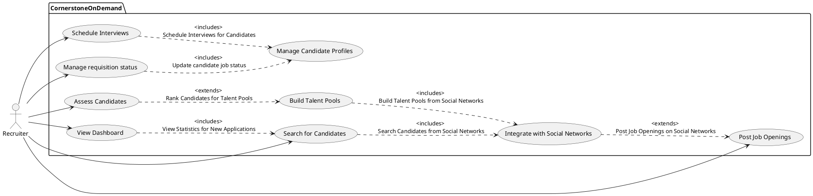
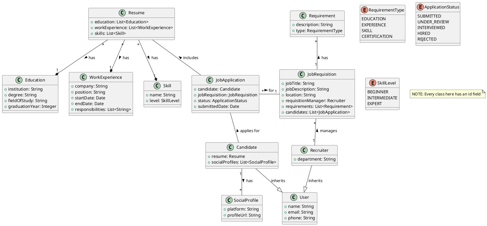
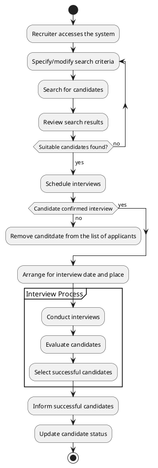
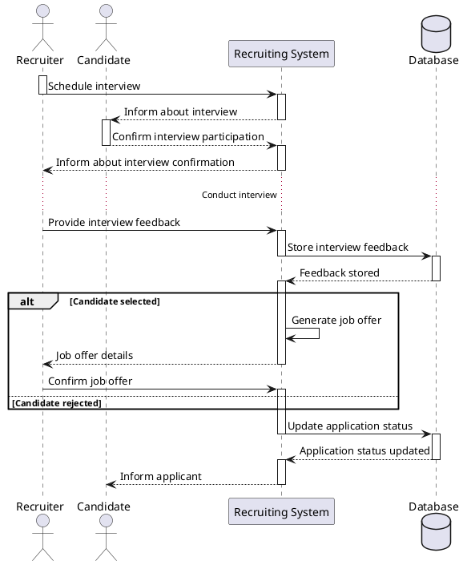

# Use-cases diagram

```plantuml
@startuml
left to right direction
actor Recruiter

package "CornerstoneOnDemand" {
 usecase "Search for Candidates" as UC1
 usecase "Manage Candidate Profiles" as UC2
 usecase "Schedule Interviews" as UC3
 usecase "View Dashboard" as UC4
 usecase "Assess Candidates" as UC5
 usecase "Manage requisition status" as UC6
 usecase "Build Talent Pools" as UC7
 usecase "Post Job Openings" as UC8
 usecase "Integrate with Social Networks" as UC9
}

Recruiter --> UC1
Recruiter --> UC3
Recruiter --> UC4
Recruiter --> UC5
Recruiter --> UC6
Recruiter --> UC8

UC1 ..> UC9 : <includes>\n Search Candidates from Social Networks
UC3 ..> UC2 : <includes>\n Schedule Interviews for Candidates
UC6 ..> UC2 : <includes>\n Update candidate job status
UC4 ..> UC1 : <includes>\n View Statistics for New Applications
UC5 ..> UC7 : <extends>\n Rank Candidates for Talent Pools
UC7 ..> UC9 : <includes>\n Build Talent Pools from Social Networks
UC9 ..> UC8 : <extends>\n Post Job Openings on Social Networks

@enduml
```

# Class diagram

```plantuml
@startuml
class User {
   + name: String
   + email: String
   + phone: String
}

class Recruiter {
   + department: String
}


class Candidate {
   + resume: Resume
   + socialProfiles: List<SocialProfile>
}

class JobRequisition {
   + jobTitle: String
   + jobDescription: String
   + location: String
   + requisitionManager: Recruiter
   + requirements: List<Requirement>
   + candidates: List<JobApplication>
}

class JobApplication {
   + candidate: Candidate
   + jobRequisition: JobRequisition
   + status: ApplicationStatus
   + submittedDate: Date
}

class Resume {
   + education: List<Education>
   + workExperience: List<WorkExperience>
   + skills: List<Skill>
}

class Requirement {
   + description: String
   + type: RequirementType
}

enum RequirementType {
   EDUCATION
   EXPERIENCE
   SKILL
   CERTIFICATION
}

enum ApplicationStatus {
   SUBMITTED
   UNDER_REVIEW
   INTERVIEWED
   HIRED
   REJECTED
}

class SocialProfile {
   + platform: String
   + profileUrl: String
}

class Education {
   + institution: String
   + degree: String
   + fieldOfStudy: String
   + graduationYear: Integer
}

class WorkExperience {
   + company: String
   + position: String
   + startDate: Date
   + endDate: Date
   + responsibilities: List<String>
}

class Skill {
   + name: String
   + level: SkillLevel
}

enum SkillLevel {
   BEGINNER
   INTERMEDIATE
   EXPERT
}

Recruiter --|> User : inherits
Candidate --|> User : inherits

Recruiter "1" -up- "*" JobRequisition : manages >
JobRequisition "1" -up- "*" Requirement : has >

Candidate -up- JobApplication : applies for >
JobApplication "*" -right- "1" JobRequisition : for >
JobApplication -up- Resume : includes >

Resume "*" --* "1" Education : has >
Resume "*" --* "1" WorkExperience : has >
Resume "*" --* "1" Skill : has >

Candidate "1" -down- "*" SocialProfile : has >


note "NOTE: Every class here has an id field" as general_note
@enduml
```

# Activity diagram

```plantuml
@startuml
start

:Recruiter accesses the system;
repeat :Specify/modify search criteria;
	:Search for candidates;
	:Review search results;
repeat while (Suitable candidates found?) is (no)
->yes;

		:Schedule interviews;
		if (Candidate confirmed interview) then (no)
			:Remove canditdate from the list of applicants;
			detach
		else (yes)
		endif
		:Arrange for interview date and place;
		partition "Interview Process" {
			:Conduct interviews;
			:Evaluate candidates;
			:Select successful candidates;
		}
		:Inform successful candidates;
		:Update candidate status;
stop

@enduml
```

# Sequence diagram

```plantuml
@startuml
actor Recruiter
actor Candidate
participant "Recruiting System" as System
database Database

activate Recruiter
Recruiter -> System: Schedule interview
deactivate Recruiter
activate System
System --> Candidate: Inform about interview
deactivate System
activate Candidate
Candidate --> System: Confirm interview participation
deactivate Candidate
activate System
System --> Recruiter: Inform about interview confirmation
deactivate System

... Conduct interview ...

Recruiter -> System: Provide interview feedback
activate System
System -> Database: Store interview feedback
deactivate System
activate Database
Database --> System: Feedback stored
deactivate Database
activate System

alt Candidate selected
    System -> System: Generate job offer
    System --> Recruiter: Job offer details
    deactivate System
    Recruiter -> System: Confirm job offer
    activate System
else Candidate rejected
	
end


activate System
System -> Database: Update application status
deactivate System
activate Database
Database --> System: Application status updated
deactivate Database
activate System
System --> Candidate: Inform applicant

deactivate Recruiter
deactivate System

@enduml
```
